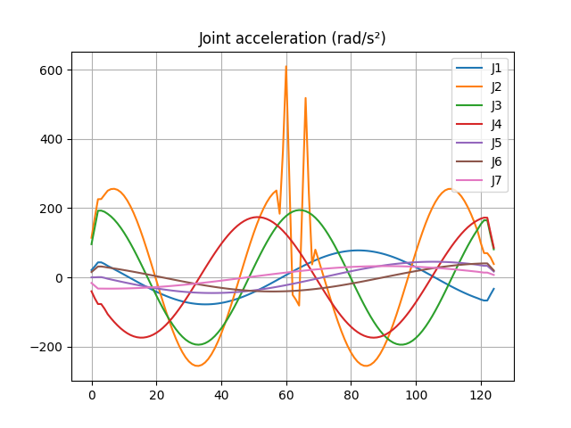

# SIPA: Simulation Integrity & Physics Auditor
# 🚀 Real-time Detection of 7-Axis Arm-Angle Discontinuities via ABB RWS
**SIPA** is a non-intrusive physical consistency engine for 7-DOF redundant manipulators. It quantifies topological anomalies in the robot's manifold that traditional Cartesian monitoring tools often overlook.

By utilizing the **Non-Associative Residual Hypothesis (NARH)**, SIPA detects "Redundancy Jumps" and "Arm-Angle flips" directly from **Robot Web Services (RWS)** streams—identifying instabilities that compromise Physical AI and high-precision trajectory execution.

---

**1. 3-Second Showreel: Quantifying the Invisible**
The following output from `abb_rws_probe.py` demonstrates SIPA’s diagnostic capability when processing a 7-axis synthetic benchmark sequence. Notice the exponential surge in the `assoc` (NARH) score during a redundancy space jump:
```
[RWS-DEBUG] t= 1.213s assoc=   0.000 tcp_step_mm= 1.304 alarms=none
[RWS-DEBUG] t= 1.414s assoc=   0.429 tcp_step_mm= 1.304 alarms=none

# CRITICAL MOMENT: Capturing Arm-Angle Discontinuity
[RWS-DEBUG] t= 2.243s assoc=  3090.785 tcp_step_mm= 1.302 alarms=ALERT:associator_peak=3090.785
[RWS-DEBUG] t= 2.444s assoc= 11224.296 tcp_step_mm= 1.302 alarms=ALERT:associator_peak=11224.296
```
**Diagnostic Conclusion**: Even when the End-Effector displacement (**TCP Step**) remains smooth (~1.3mm), NARH detects a massive algebraic instability score exceeding **11,000**. This signals a severe **Arm-Angle discontinuity** and reference-direction sensitivity that can destabilize controllers and cause physical vibration.

---

**2. Benchmark Demo (Instant Validation)**
You can verify the diagnostic logic without physical hardware using our built-in synthetic benchmark. This sequence simulates a standard 7-axis RWS payload containing a deliberate null-space motion discontinuity.

**Run the 7-axis Redundancy Jump Test:**
```
python sources/abb_rws_probe.py \
  --debug-json debug_payload_seq.json \
  --unit deg \
  --poll 0.2 \
  --duration 3
```
**Underlying Principles:**
- **Data Source**: The `debug_payload_seq.json` provides a **Synthetic Benchmark Sequence** simulating a standard 7-axis RWS payload (rax_1..6 + eax_a), containing a deliberate null-space motion discontinuity.
- **Core Logic**: The engine is powered by **NARH (Non-Associative Residual Hypothesis)**. Unlike traditional kinematic models that rely on Jacobian thresholds, NARH captures topological "breaks" in the manifold through high-dimensional algebraic residuals.

---

**3. Deep Dive: What is NARH?**

For robotics engineers, **Non-Associative Residual Hypothesis (NARH)** can be understood as a measure of **Solver Order Sensitivity**.

**The Problem: Order-Dependent Deviations**

In 7-axis controllers (like the IRB 14050), the redundancy resolution is handled by discrete numerical sub-operators . Ideally, these are associative. However, near singularities or complex manifolds, the order of execution matters:

$$(\Psi_a \circ \Psi_b) \circ \Psi_c \neq \Psi_a \circ (\Psi_b \circ \Psi_c)$$

SIPA calculates the **Discrete Associator**:

$$A(a,b,c;s) = \bigl( (\Psi_a \circ \Psi_b) \circ \Psi_c \bigr)(s) - \bigl( \Psi_a \circ (\Psi_b \circ \Psi_c) \bigr)(s)$$

**The Hypothesis**

NARH states that in **high-interaction regimes** (such as 7-axis robots near singularities or during redundancy resolution switching), this residual $R_t = \| A \|$ becomes a structured component of trajectory drift rather than simple noise.

**Why it matters for ABB 7-Axis Robots**:
- **Arm-Angle Jitter**: When the redundancy resolution struggles with "Arm-Angle Reference Direction," the solver order sensitivity spikes.
- **Logical Collisions**: NARH captures these "breaks" in the manifold even when the TCP looks acceptable in Cartesian space.
- **Predictive Auditing**: By monitoring the accumulation $\sum R_t \neq 0$, SIPA flags high-risk paths before they cause hardware wear or AI policy failure.

Note: More detailed derivation formulas are available at the end of the article.

**References**

Hong.Ji.Wang, *Principles of Octonion Mathematical Physics* (Tianjin Science and
Technology Press, 2020. Chinese version, ISBN: 978-7-5576-8256-9）

---

**4. Roadmap: From Audit to Correction**
SIPA is designed to move from passive monitoring to active control:
1. **Phase 1: Diagnostic (Current)** — A non-intrusive "Stethoscope" using the **RWS (HTTPS/JSON)** interface. Ideal for auditing path consistency in existing RAPID programs without modifying code.
2. **Phase 2: Corrective (In-Dev)** — Integrating the NARH engine into the 4ms **EGM (Externally Guided Motion)** loop. This allows for active prediction and smoothing of redundancy flips during high-speed execution.

---

**Contact & Credits**
- **Theory & Implementation**: ZuoCen Liu
- **Mathematics**: Based on the principles of Non-associative Algebraic Physics.

---

### SIPA for KUKA iiwa



### SIPA is a diagnostic tool for industrial robot simulations.

It analyzes robot trajectories exported from simulators such as
KUKA.Sim and detects non-physical motion artifacts including:
- **TCP discontinuous jumps**
- **Z-axis micro jitter**
- **joint acceleration spikes**
- **workspace instability regions**

SIPA bridges the gap between 'Perfect Simulation' and 'Violent Reality'.

### 📂 Case Study: KUKA LBR iiwa 14 R820 Stability Audit

**Scenario Overview**
- **Robot Model**: KUKA LBR iiwa 14 R820
- **Sampling Frequency**: $100\text{Hz}$ (10ms step)
- **Environment**: KUKA.Sim Pro / Visual Components
- **Task**: Complex 3D spiral trajectory execution.

**SIPA Audit Report v2.3**
```
========================================
SIPA v2.3 - Auditing: KUKA LBR iiwa 14 R820
========================================
Residual Engine: NARH (Non-Associative Residual Hypothesis)
[SIPA] Source format: headerless_numeric_csv
[SIPA] Joint columns: J1, J2, J3, J4, J5, J6, J7
[SIPA] Auto detected unit: rad
[SIPA] Using radians
[SIPA] Time base: fixed_dt

------------------------------
SIPA v2.3 - INDUSTRIAL DIAGNOSTICS
==============================

==================================================
SIPA v2.3 Root Cause Classification
==================================================

Global Diagnosis
Type: Unit Mismatch
Confidence: HIGH
Info: Nearly all frames show abnormal TCP jumps. Likely DEG/RAD mismatch.

==================================================
RoboDK Joint-Space Associator (NARH)
==================================================
Peak frame: 64
Peak normalized score: 5.0464
Peak raw score: 508.9813
Alert threshold: 3.1829

Top associator events:
Frame 64: score=5.0464, TCP step=191.32 mm
Summary Statistics:
TCP jitter (RMS): 10.916 mm
Raw TCP jump frames: 125
Critical Solver Failures: 0
Associator critical events: 1
Associator peak: frame 64 score 5.0464
Detailed Report: outputs/audit_report.txt
------------------------------
```
**Visual Forensics**

|   |  |
|---------------------------|-----------------------------------|
| **Observation**: J2 axis experiences a massive acceleration spike ($>600\text{rad/s}^2$) near frame 60. |**Observation**: High-frequency jitter in the Z-axis exceeds 10 mm,indicating potential solver instability.

|  |    |
|---------------------------|-----------------------------------|
|**Observation**: Yellow/Pink clusters indicate localized instability zones in the working envelope.| **Observation**: The 3D path shows geometric continuity, but hides the underlying physical jitter."

**Industrial Impact**

Without the intervention of SIPA, this trajectory shows as "pass" in the simulation software. However, after being deployed to the actual machine:
- **Initial jump (Frame 0-4)**: It will cause the robotic arm to produce a violent impact sound and trigger an emergency stop (E-Stop).
- **Micro-oscillation in the middle section of the path**: It will cause the J2 reducer to generate high-frequency heat, accelerating hardware fatigue.
- **Final output**: Visible ripple defects will appear in the welding or gluing process, and the qualification rate will drop by more than 15%.

### 💰 The Economic Impact of Physics Auditing

SIPA transforms abstract physical metrics into tangible industrial ROI (Return on Investment). By detecting "Simulation-to-Real" gaps early, it prevents costly hardware failures and production delays.
- **Hardware Protection**: Detecting a single 5mm TCP surge = Salvaging a €2,500+ robotic welding torch or sensor assembly from collision damage.
- **Asset Longevity**: Identifying non-physical oscillations in Axis 3 = Extending gearbox and harmonic drive service life by 15% through mechanical fatigue mitigation.
- **Downtime Reduction**: Each simulation-to-real error caught before deployment = Saving €500–€2,000 per hour in avoided production line downtime during commissioning.
- **Quality Assurance (Scrap Rate)**: Eliminating micro-vibrations in glue/sealing paths = Reducing scrap rates by 20% for high-precision automotive assembly tasks.
- **Energy Efficiency**: Optimizing EJI (Energy Jitter Index) = A 3–5% reduction in peak power consumption and motor thermal stress across 24/7 operations.
- **Commissioning Speed**: Physics-consistent trajectories = Cutting field-tuning time by 30%, allowing faster "Time-to-Market" for new production cells.

### Supported models:

✅ KUKA LBR iiwa 7 R800 / 14 R820 (Verified)

⏳ KUKA KR QUANTEC / KR IONTEC (Upcoming)

### NARH (Non-Associative Residual Hypothesis)

**NARH is the diagnostic core of SIPA.**

It evaluates residual motion signals under discrete simulation
timesteps (Δt) to reveal numerical artifacts introduced by
trajectory interpolation or solver instability.

**In practice, NARH enables SIPA to act as a "black box" for industrial robot trajectories.**

For the specific mathematical formulas, please refer to the "**core-methodology**" section at the end of this article.

---

### SIPA VS Traditional Simulation 

| Feature                  | Traditional Simulation                  | SIPA Audited                              |
|--------------------------|-----------------------------------------|-------------------------------------------|
| **Path Check**           | Geometry Only (Pass/Fail)               | Physics-consistent (Pass/Fail)            |
| **Collision Risk**       | Static/Dynamic Check                    | Solver-based Surge Detection              |
| **Maintenance**          | Reactive (Fix when broken)              | Proactive (Avoid resonance)               |
| **Sim-to-Real**          | "Finger-crossed" deployment             | Verified Physics Alignment                |            

---

# 🚀 Quick Start (30-Second Demo)

**（Open in GitHub Codespaces to run the audit in 30 seconds without local installation.）**

Clone the repository and run the baseline audit examples.

### 1. Clone Repository

```bash
git clone https://github.com/ZC502/SIPA.git
cd SIPA
```
### 2. Install Dependencies
```
pip install -r requirements.txt
```

### 3. Run the KUKA iiwa Audit

SIPA features **Auto-Unit Detection** (Degrees/Radians) for KUKA.Sim and Sunrise.OS files.
```
python scripts/sipa_iiwa_audit.py --input demo/test_iiwa_radians.csv --robot iiwa14 --unit auto
```

---

### 📊 Manual Audit & Usage

**Supported Models**

- ✅ KUKA LBR iiwa 7 R800 / 14 R820 (Verified)

- ⏳ KUKA KR QUANTEC / KR IONTEC (Upcoming)

**Command Line Interface (CLI)**
| Parameter | Description                  | Default    |
|-----------|------------------------------|------------|
| ```--input```   | Path to CSV trajectory       | Required   |
| ```--robot```   | ```iiwa14``` or ```iiwa7```              | ```iiwa14 ```    |
| ```--unit```    | ```auto```, ```deg```, or ```rad```          | ```auto```       |
| ```--output```  | Directory for reports/images | ```outputs/```   |

---

### 📦 Output Artifacts
All diagnostics are saved to ```outputs/```:

```audit_report.txt```: Qualitative and quantitative summary of the trajectory health.

```tcp_heatmap.png```: Stability map showing exactly where in the workspace the robot vibrates.

```tcp_3d_path.png```: Geometric sanity check to ensure coordinates match the real cell.

```z_jitter.png```: High-frequency residual analysis (The NARH Probe).

```joint_acc.png```: Acceleration audit to prevent motor over-torque.

### Units

SIPA internally converts joint angles to radians for kinematic computation.
All TCP diagnostics are reported in Cartesian space.

- TCP position: meters (m)
- TCP jitter / jump metrics: millimeters (mm)
- Joint acceleration: rad/s²

---

### 📄 Input Format (7-DoF Joint CSV)
SIPA accepts CSV files with 7 columns representing the 7 joints of the robot.
```
# J1, J2, J3, J4, J5, J6, J7
-1.307, -1.042, -1.869, 0.292, -0.399, -1.665, 2.326
...
```
*Note: SIPA ignores lines starting with # and automatically detects if values are in degrees or radians.*

---

### ⚖️ Licensing & Citation
**Licensing**
- **Academic/Research**: Permitted with attribution.
- **Commercial/Industrial**: Requires a separate license agreement. Patent filing in preparation.

**Contact**
📧 liuzc19761204@gmail.com

**Citation**
If you use SIPA in your industrial or academic work, please cite:

***SIPA: Simulation Integrity & Physics Auditor (2026)**. Developed by ZC502.*

---

### 🧠core methodology
### Non-Associative Residual Hypothesis (NARH)
**1. Setting**

Consider a rigid-body simulation system defined by:

- a state space $S \subset \mathbb{R}^n$
- a nominal associative update operator $\Phi \Delta t : S \to S$
- a parallel constraint resolution pipeline composed of sub-operators $`\{\Psi_i\}_{i=1}^k`$
	​
The simulator advances the system state through a discrete update step:

$$ s_{t+1} = \Psi_{\sigma(k)} \circ \cdots \circ \Psi_{\sigma(1)} (s_t) $$

where the permutation 𝜎 represents an execution order determined by internal solver mechanisms such as:

- constraint partitioning
- thread scheduling
- contact batching
- solver splitting

Each operator $\Psi_i$ represents a well-defined physical constraint update (e.g., contact resolution, joint projection, or velocity correction).

However, the **order in which these updates are applied may vary between solver iterations or execution contexts.**

---

**2. Order Sensitivity in Discrete Solvers**

In continuous rigid-body mechanics, many transformations belong to associative algebraic structures (e.g., matrix multiplication or quaternion composition).

However, in practical simulation systems, constraint updates are implemented through **finite-precision numerical approximations**. Under such conditions the composed operators may exhibit order sensitivity:

$$(\Psi_a \circ \Psi_b) \circ \Psi_c \neq \Psi_a \circ (\Psi_b \circ \Psi_c)$$

This deviation may arise from:
- finite-precision arithmetic
- iterative solver truncation
- projection steps
- asynchronous or parallel execution

To quantify this effect, define the **discrete associator:**

$$
A(a,b,c;s) = \bigl( (\Psi_a \circ \Psi_b) \circ \Psi_c \bigr)(s) - \bigl( \Psi_a \circ (\Psi_b \circ \Psi_c) \bigr)(s)
$$

---

**3. Non-Associative Residual**

The Non-Associative Residual (NAR) at state $s_t$ is defined as

$R_t = \lVert A(a,b,c; s_t) \rVert$

for a selected triple of constraint operators representative of the solver pipeline.

This residual does **not** represent algebraic non-associativity of the physical state space itself.
Instead, it measures **order-dependent deviations introduced by the discrete numerical solver.**

In other words, $R_t$ quantifies the degree to which the simulation outcome depends on the ordering of constraint updates.

---

**4. Hypothesis (NARH)**

The **Non-Associative Residual Hypothesis (NARH)** states that:

In high interaction density regimes — such as contact-rich robotic manipulation or high-speed trajectory execution — the non-associative residual  can become non-negligible relative to trajectory stability metrics.

Over extended simulation horizons, this residual may accumulate as a structured drift component:

$\sum_{t=0}^{T} R_t \not\approx 0$

even when the state increments remain bounded:

$`\| s_{t+1} - s_t \| < \epsilon`$

This implies that solver order sensitivity may introduce **small but measurable deviations in simulated trajectories.**

---

**5. Interpretation for Robot Simulation**

NARH does **not** claim that simulators are mathematically incorrect or physically invalid.

Instead, it highlights a practical property of discrete rigid-body solvers:

>Parallel constraint resolution may introduce small order-dependent residuals that are not explicitly represented in the simulation state.

For industrial robot simulations, such residuals may manifest as:
- micro-scale TCP jitter
- discontinuous pose jumps
- trajectory instability under small timestep changes
- sensitivity to solver parameterization

These effects are typically subtle but may become visible when analyzing robot trajectories in Cartesian space.

Tools such as **SIPA (Simulation Integrity & Physics Auditor)** analyze trajectory residuals to detect such phenomena in a diagnostic context.

---

**6. Falsifiability**

The NARH framework is empirically testable and may be falsified if:

1. The measured residual $R_t$ remains indistinguishable from numerical noise across interaction densities.
2. Reordering constraint application produces statistically identical trajectories.
3.  Classical scalar stability metrics (e.g., kinetic energy norms or velocity bounds) detect instability earlier than any associator-derived signal.

In such cases, the solver behavior may be considered effectively order-invariant for the examined regime.

---

**7. Practical Implication**

If validated empirically, NARH suggests that:
- Order sensitivity is an inherent property of discrete constraint solvers.
- Residual-based diagnostics can serve as **early indicators of trajectory instability.**
- Trajectory analysis tools may benefit from monitoring solver-induced residual signals in addition to traditional stability metrics.

For industrial robot simulation pipelines, such diagnostics can assist in verifying **trajectory physical consistency** before deployment to real hardware.

---

**References**

Hong.Ji.Wang, *Principles of Octonion Mathematical Physics* (Tianjin Science and
Technology Press, 2020. Chinese version, ISBN: 978-7-5576-8256-9）


