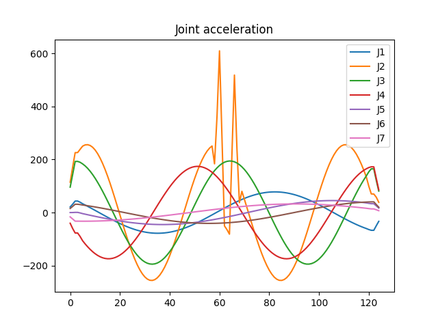
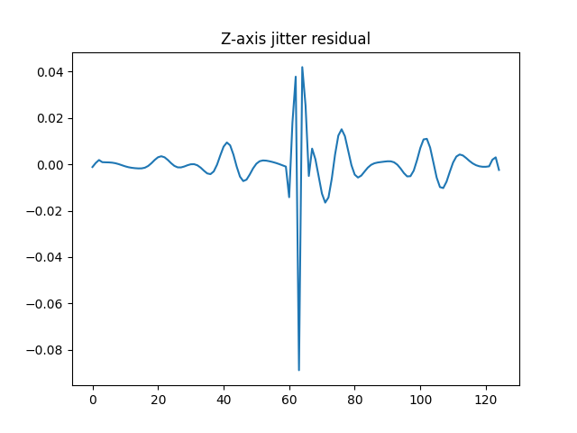
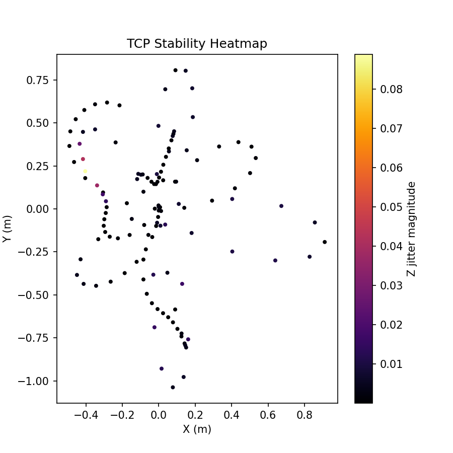
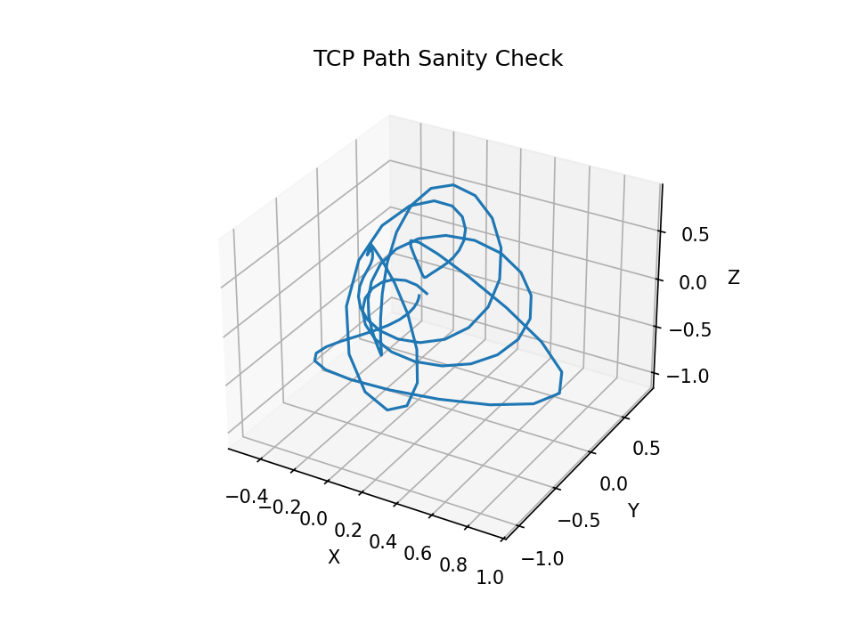

# SIPA: Simulation Integrity & Physics Auditor
*The Black Box Auditor for Industrial Robot Trajectories*

### SIPA is a diagnostic tool for industrial robot simulations.

It analyzes robot trajectories exported from simulators such as
KUKA.Sim and detects non-physical motion artifacts including:
- **TCP discontinuous jumps**
- **Z-axis micro jitter**
- **joint acceleration spikes**
- **workspace instability regions**

### 📂 Case Study: KUKA LBR iiwa 14 R820 Stability Audit

**Scenario Overview**
- **Robot Model**: KUKA LBR iiwa 14 R820
- **Sampling Frequency**: $100\text{Hz}$ (10ms step)
- **Environment**: KUKA.Sim Pro / Visual Components
- **Task**: Complex 3D spiral trajectory execution.

**SIPA Audit Report v2.1**
```
Robot: KUKA LBR iiwa 14 R820
Frames: 125 | Frequency: 100Hz

[CRITICAL] TCP Z Jitter: 10.96 mm (Std Amplitude)
[WARNING] TCP Jump Events Detected at Initialization (Frame 0-4)
          Max Jump: 85.40 mm
[DIAGNOSIS] Micro-oscillation detected at Joint 2 (Mid-path).
[RISC LEVEL] HIGH: Potential Gearbox Resonance & Controller Overcurrent
```
**Visual Forensics**

|   |  |
|---------------------------|-----------------------------------|
| **Observation**:J2 axis experiences a massive acceleration spike ($>600\text{deg/s}^2$) near frame 60. |**Observation**: High-frequency jitter in Z-axis exceeds 0.04m, indicating solver divergence.

|  |    |
|---------------------------|-----------------------------------|
|**Observation**: Yellow/Pink clusters indicate localized instability zones in the working envelope.| **Observation**: The 3D path shows geometric continuity, but hides the underlying physical jitter."

**Industrial Impact**

Without the intervention of SIPA, this trajectory shows as "pass" in the simulation software. However, after being deployed to the actual machine:
- **Initial jump (Frame 0-4)**: It will cause the robotic arm to produce a violent impact sound and trigger an emergency stop (E-Stop).
- **Micro-oscillation in the middle section of the path**: It will cause the J2 reducer to generate high-frequency heat, accelerating hardware fatigue.
- **Final output**: Visible ripple defects will appear in the welding or gluing process, and the qualification rate will drop by more than 15%.

### 💰 The Economic Impact of Physics Auditing

SIPA transforms abstract physical metrics into tangible industrial ROI (Return on Investment). By detecting "Simulation-to-Real" gaps early, it prevents costly hardware failures and production delays.
- **Hardware Protection**: Detecting a single 5mm TCP surge = Salvaging a €2,500+ robotic welding torch or sensor assembly from collision damage.
- **Asset Longevity**: Identifying non-physical oscillations in Axis 3 = Extending gearbox and harmonic drive service life by 15% through mechanical fatigue mitigation.
- **Downtime Reduction**: Each simulation-to-real error caught before deployment = Saving €500–€2,000 per hour in avoided production line downtime during commissioning.
- **Quality Assurance (Scrap Rate)**: Eliminating micro-vibrations in glue/sealing paths = Reducing scrap rates by 20% for high-precision automotive assembly tasks.
- **Energy Efficiency**: Optimizing EJI (Energy Jitter Index) = A 3–5% reduction in peak power consumption and motor thermal stress across 24/7 operations.
- **Commissioning Speed**: Physics-consistent trajectories = Cutting field-tuning time by 30%, allowing faster "Time-to-Market" for new production cells.

### Supported models:

✅ KUKA LBR iiwa 7 R800 / 14 R820 (Verified)

⏳ KUKA KR QUANTEC / KR IONTEC (Upcoming)

### NARH (Non-Associative Residual Hypothesis)

**NARH is the diagnostic core of SIPA.**

It evaluates residual motion signals under discrete simulation
timesteps (Δt) to reveal numerical artifacts introduced by
trajectory interpolation or solver instability.

**[In practice, NARH enables SIPA to act as a "black box"
for industrial robot trajectories.](#core-methodology)**

---

# 🚀 Quick Start (30-Second Demo)

**（Open in GitHub Codespaces to run the audit in 30 seconds without local installation.）**

Clone the repository and run the baseline audit examples.

### 1. Clone Repository

```bash
git clone https://github.com/ZC502/SIPA.git
cd SIPA
```
### 2. Install Dependencies
```
pip install -r requirements.txt
```

### 3. Run the KUKA iiwa Audit

SIPA features **Auto-Unit Detection** (Degrees/Radians) for KUKA.Sim and Sunrise.OS files.
```
python scripts/sipa_iiwa_audit.py --input demo/test_iiwa_radians.csv --robot iiwa14 --unit auto
```

---

### 📊 Manual Audit & Usage

**Supported Models**

- ✅ KUKA LBR iiwa 7 R800 / 14 R820 (Verified)

- ⏳ KUKA KR QUANTEC / KR IONTEC (Upcoming)

**Command Line Interface (CLI)**
| Parameter | Description                  | Default    |
|-----------|------------------------------|------------|
| ```--input```   | Path to CSV trajectory       | Required   |
| ```--robot```   | ```iiwa14``` or ```iiwa7```              | ```iiwa14 ```    |
| ```--unit```    | ```auto```, ```deg```, or ```rad```          | ```auto```       |
| ```--output```  | Directory for reports/images | ```outputs/```   |

---

### 📦 Output Artifacts
All diagnostics are saved to ```outputs/```:

```audit_report.txt```: Qualitative and quantitative summary of the trajectory health.

```tcp_heatmap.png```: Stability map showing exactly where in the workspace the robot vibrates.

```tcp_3d_path.png```: Geometric sanity check to ensure coordinates match the real cell.

```z_jitter.png```: High-frequency residual analysis (The NARH Probe).

```joint_acc.png```: Acceleration audit to prevent motor over-torque.

---

### 📄 Input Format (7-DoF Joint CSV)
SIPA accepts CSV files with 7 columns representing the 7 joints of the robot.
```
# J1, J2, J3, J4, J5, J6, J7
-1.307, -1.042, -1.869, 0.292, -0.399, -1.665, 2.326
...
```
*Note: SIPA ignores lines starting with # and automatically detects if values are in degrees or radians.*

---

### ⚖️ Licensing & Citation
**Licensing**
- **Academic/Research**: Permitted with attribution.
- **Commercial/Industrial**: Requires a separate license agreement. Patent filing in preparation.

**Contact**
📧 liuzc19761204@gmail.com

**Citation**
If you use SIPA in your industrial or academic work, please cite:

***SIPA: Simulation Integrity & Physics Auditor (2026)**. Developed by ZC502.*

---

core-methodology
### 🧠Non-Associative Residual Hypothesis (NARH)

**1. Setting**

Consider a rigid-body simulation system defined by:

- State space $S \subset \mathbb{R}^n$
- Associative update operator $\Phi \Delta t : S \to S$
- Parallel constraint resolution composed of sub-operators $`\{\Psi_i\}_{i=1}^k`$

	​
The simulator implements a discrete update:

$$ s_{t+1} = \Psi_{\sigma(k)} \circ \cdots \circ \Psi_{\sigma(1)} (s_t) $$


where 𝜎 is an execution order induced by:

- constraint partitioning
- thread scheduling
- contact batching
- solver splitting

Each $\Psi_i$ is individually well-defined, but their composition order may vary.

---

**2. Order Sensitivity**

Although each operator $\Psi_i$ belongs to an associative algebra (e.g., matrix multiplication, quaternion composition), the **composition of numerically approximated operators** may satisfy:

$$(\Psi_a \circ \Psi_b) \circ \Psi_c \neq \Psi_a \circ (\Psi_b \circ \Psi_c)$$

due to:

- finite precision arithmetic
- projection steps
- iterative convergence truncation
- asynchronous execution

Define the discrete associator:

$$
A(a,b,c;s) = \bigl( (\Psi_a \circ \Psi_b) \circ \Psi_c \bigr)(s) - \bigl( \Psi_a \circ (\Psi_b \circ \Psi_c) \bigr)(s)
$$


---

**3. Definition: Non-Associative Residual**

We define the **Non-Associative Residual (NAR)** at state $s_t$ as:

$R_t = \lVert A(a,b,c; s_t) \rVert$

for a chosen triple of sub-operators representative of contact or constraint updates.

This residual measures **path-dependence induced by discrete solver ordering**, not algebraic non-associativity of the state representation.

---

**4. Hypothesis (NARH)**

In high-interaction-density regimes (e.g., contact-rich robotics, high-speed manipulation), the Non-Associative Residual $R_t$ becomes non-negligible relative to scalar stability metrics, and accumulates over time as a structured drift term.

Formally, there exists a regime such that:

$\sum_{t=0}^{T} R_t \not\approx 0$

even when:

$\Vert s_{t+1} - s_t \Vert$ remains bounded.

**Metric Upgrade (v0.4.2)**: > We shift from instantaneous $R_t$ to **Time-Integrated Path Debt** $\int R_t dt$. In high-interaction regimes, this term scales super-linearly, representing a "Physical Interest Rate" that embodied AI agents must pay but cannot perceive.

---

**5. Interpretation**

This hypothesis does **not** claim:

- that simulators are mathematically invalid,
- that associative algebras are incorrect,
- or that hardware tiling causes topological inconsistency.

Instead, it asserts:

Discrete parallel constraint resolution introduces a measurable order-dependent residual that is not explicitly encoded in the state space.

This residual may contribute to:

- sim-to-real divergence,
- policy brittleness,
- instability under reordering of equivalent control inputs.

---

**6. Falsifiability**

NARH is falsified if:

1. $R_t$​ remains within numerical noise across interaction densities.
2. Reordering constraint application yields statistically indistinguishable trajectories.
3. Scalar metrics (e.g., kinetic energy norm, velocity norm) detect instability earlier or equally compared to any associator-derived signal.

---

**7. Research Implication**

If validated, NARH suggests that:

- Order sensitivity is a structural property of discrete solvers.
- Additional diagnostic signals (e.g., associator magnitude) may serve as early-warning indicators.
- Embodied AI training in simulation may implicitly depend on hidden order-stability assumptions.

If invalidated, the experiment establishes an empirically order-invariant regime — a valuable boundary characterization of solver behavior.


[https://github.com/ZC502/TinyOEKF/blob/master/docs/Continuous_Physics_Solver_for_AI_Wang_Liu.pdf](https://github.com/ZC502/TinyOEKF/blob/master/docs/Continuous_Physics_Solver_for_AI_Wang_Liu.pdf)


